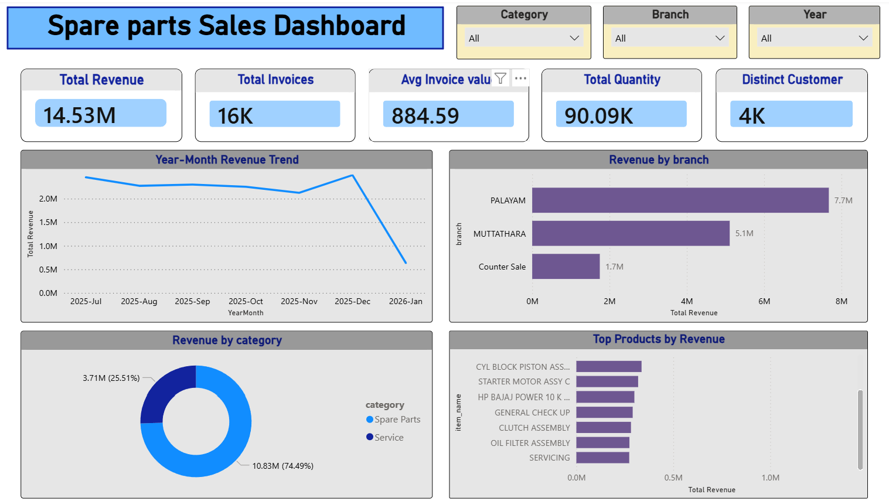

# 📊 Spare Parts Sales Analysis Dashboard | SQL + Power BI Project

## 🔍 Project Overview
This end-to-end analytics project analyzes multi-branch spare parts and service sales data to uncover revenue drivers, branch performance trends, product contribution, and growth opportunities.

The project demonstrates how raw ERP transactional data can be transformed into actionable business intelligence using **SQL for data preparation and analysis** and **Power BI for interactive dashboard reporting**.

---

## 💼 Business Problem
The business operates across multiple branches but lacked a clear and centralized view of performance.

Key challenges included:

- Which branches generate the highest revenue?
- Is revenue growing consistently over time?
- How much revenue comes from spare parts vs services?
- Which products drive the most sales?
- Where are opportunities to improve revenue and efficiency?

This project solves these challenges through data-driven analysis and dashboard reporting.

---

## 🗂️ Dataset Description
The dataset contains multi-branch sales transaction records, including:

- Branch details
- Invoice-level transactions
- Product / item information
- Spare parts & service sales
- Quantity sold
- Customer records
- Dates and posting periods
- Revenue / pricing values

### Raw Data Issues
The original data required preparation due to:

- Missing values
- Inconsistent formatting
- Duplicate-like summary rows
- Invalid records such as “Total”
- Mixed categories requiring classification

---

## 🧹 Data Cleaning & Preparation (SQL)

To create a reliable analysis-ready dataset:

- Combined multiple branch datasets into one unified table
- Standardized date, numeric, and text formats
- Handled missing branch values as **Counter Sale**
- Removed invalid/system-generated summary rows
- Created derived product categories:
  - **Spare Parts**
  - **Service**
- Cleaned branch names for reporting consistency
- Prepared fields for dashboard KPIs and filtering

---

## 📊 Power BI Dashboard Features

An interactive dashboard was built to monitor business performance with slicers for:

- Category
- Branch
- Year

### Key KPIs

- **Total Revenue:** ₹14.53M
- **Total Invoices:** 16K
- **Average Invoice Value:** ₹884.59
- **Total Quantity Sold:** 90.09K
- **Distinct Customers:** 4K

### Visual Analysis Includes

- Revenue trend by month
- Revenue by branch
- Revenue by category
- Top products by revenue

---

## 📌 Key Findings

### 1. Branch Performance
- **Palayam** is the top-performing branch (~₹7.7M)
- **Muttathara** follows (~₹5.1M)
- **Counter Sale** contributes (~₹1.7M)

### 2. Revenue Trend
Revenue remained relatively stable across most months, indicating consistent demand with room for expansion.

### 3. Category Contribution
- **Spare Parts:** ~74%
- **Service:** ~26%

Spare parts are the primary revenue driver.

### 4. Product Concentration
A limited number of products generate a significant share of revenue, creating upsell and inventory planning opportunities.

### 5. Business Model Insight
The company operates on a **high-volume, mid-ticket-size model** with steady invoice flow.

---

## 🧠 Business Insights

### Revenue Dependence Risk
A large share of revenue comes from top branches, increasing concentration risk if branch performance declines.

### Service Revenue Opportunity
Services generate lower revenue compared to spare parts, suggesting potential in pricing, bundling, and premium offerings.

### Growth Limitation
Stable sales patterns suggest operational consistency but limited growth initiatives.

### Average Order Value Potential
Increasing invoice value through cross-selling and upselling could improve total revenue without needing large customer growth.

---

## 🚀 Recommendations

### 1. Strengthen Lower Performing Branches
- Replicate successful branch practices
- Set branch-wise performance KPIs

### 2. Grow Service Revenue
- Bundle services with spare parts
- Offer maintenance packages
- Improve service pricing strategy

### 3. Increase Average Invoice Value
- Product recommendations at checkout
- Cross-sell complementary items
- Focus on premium SKUs

### 4. Improve Revenue Growth
- Seasonal promotions
- Branch campaigns
- Customer retention strategies

### 5. Monitor Top Products
- Ensure stock availability
- Promote best-selling SKUs
- Reduce overdependence through diversification

---

## 🛠️ Tools Used

- **SQL (MySQL)** – Data cleaning, transformation, analysis
- **Power BI** – Dashboard design & business reporting
- **Excel / CSV** – Raw data handling

---

## 📊 Dashboard Preview

> Interactive dashboard includes slicers, KPI cards, trend analysis, branch comparison, category split, and top products.

---

## ✅ Project Outcome

This project demonstrates my ability to:

- Clean messy business data
- Solve reporting problems
- Build structured SQL analysis
- Create professional Power BI dashboards
- Translate numbers into business decisions
- Deliver actionable recommendations

---

## 📬 Author

**HAFSA R**  
Aspiring Data Analyst focused on solving real-world business problems through data.

